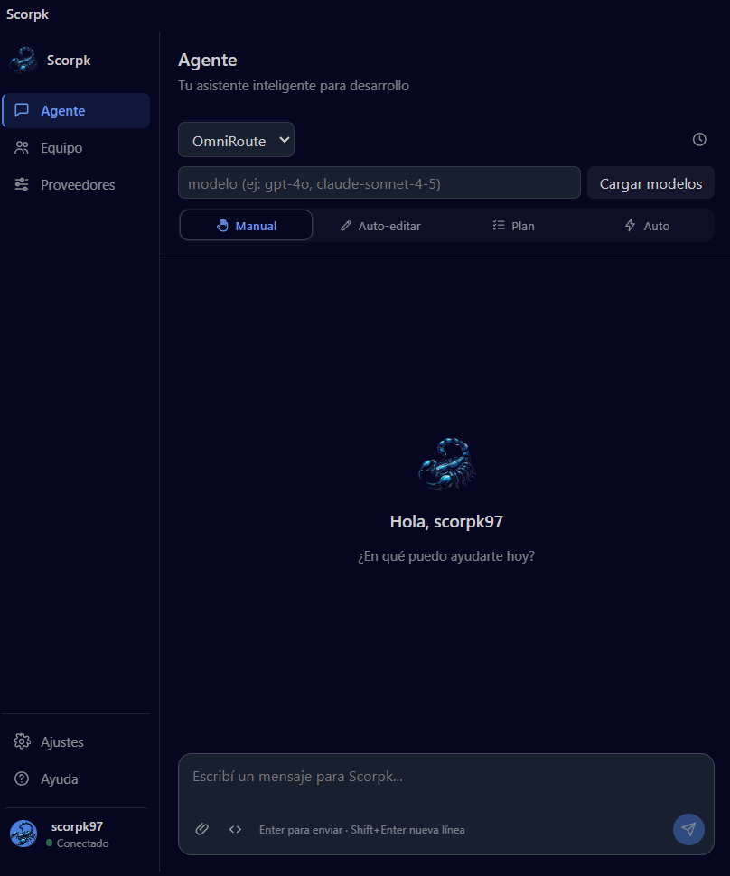
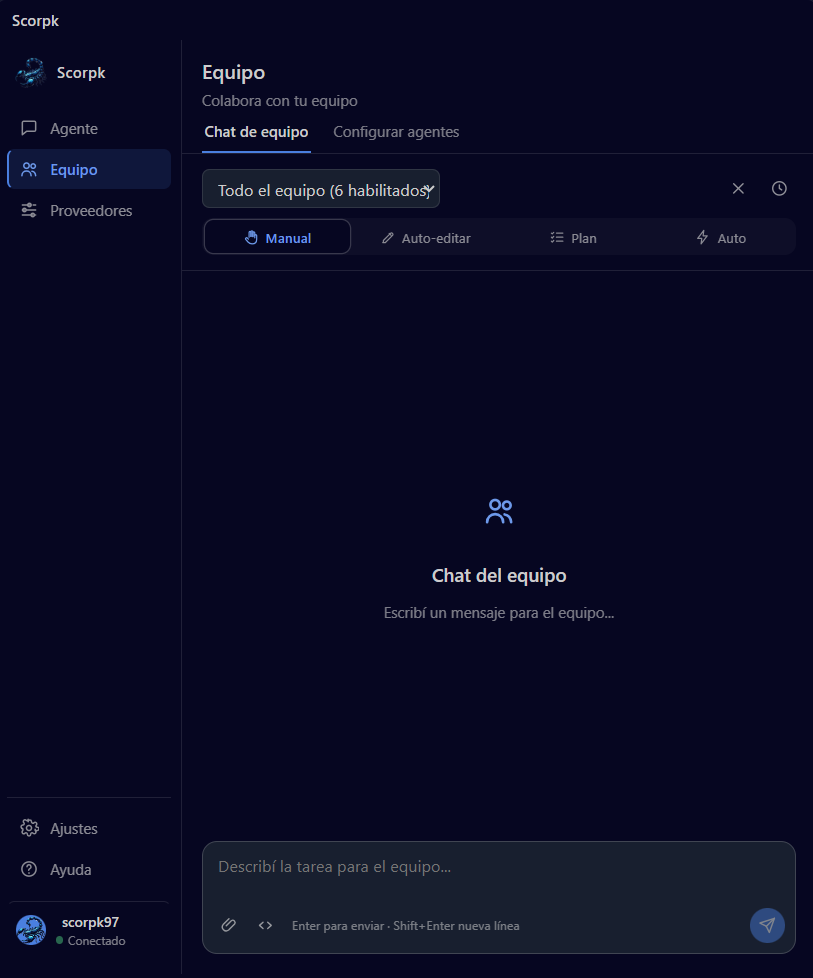
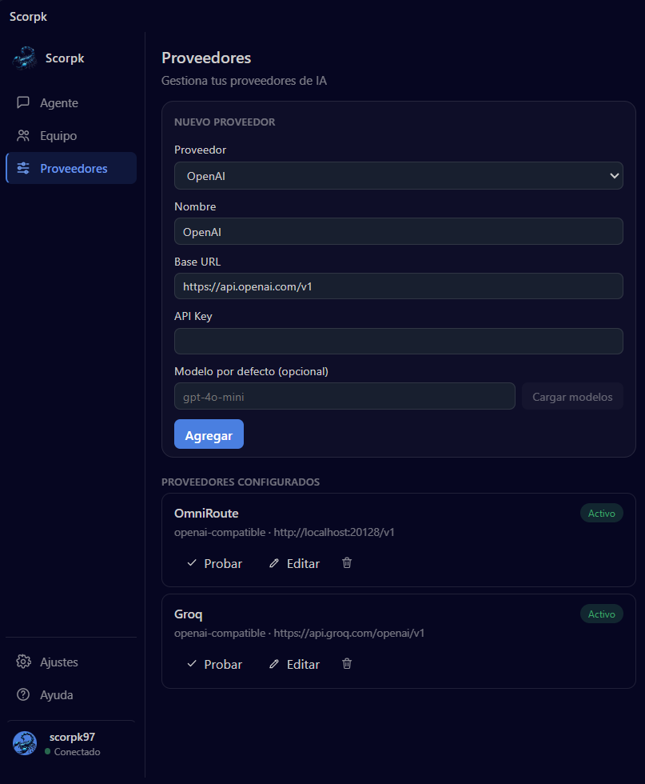

# Scorpk

**Scorpk** es un centro de control de agentes de IA para programación, integrado directamente en Visual Studio Code. Conectá cualquier proveedor compatible con OpenAI (o Anthropic), armá un equipo de agentes con roles definidos, y dejá que trabajen con acceso real a tu workspace: leer, escribir y borrar archivos, ejecutar comandos de terminal, y consultar git.

| Agente | Equipo | Proveedores |
| --- | --- | --- |
|  |  |  |

## Funcionalidades

- **Modo Agente**: chat directo contra el proveedor/modelo que elijas, con markdown, resaltado de código, e historial de conversaciones persistente entre sesiones.
- **Modo Equipo**: activá roles predefinidos (Planner, Coder, Reviewer, Tester, Documenter, Debugger) o creá los tuyos, asignale un proveedor/modelo a cada uno, y mandale una tarea a todo el equipo (se resuelve en cadena) o a un agente puntual.
- **Proveedores**: presets para OpenAI, Anthropic, Groq, Cerebras, NVIDIA NIM, OpenRouter, Kimi, DeepSeek y OmniRoute — solo hace falta pegar la API key. Selector de modelos que carga los disponibles por proveedor, con filtro de gratis/todos.
- **4 modos de permiso** (igual que en las herramientas de agentes más conocidas):
  - **Manual** — pide aprobación antes de cada acción que modifique el workspace.
  - **Auto-editar** — aprueba solo lectura/escritura de archivos; la terminal sigue pidiendo confirmación.
  - **Plan** — el agente solo investiga (lectura) y devuelve un plan, no ejecuta cambios.
  - **Auto** — aprueba todo automáticamente, sin preguntar (pide confirmación explícita la primera vez que lo activás).
- **Preview de diff** antes de aprobar una escritura o un borrado de archivo.
- Botón para **cancelar** una ejecución en curso.
- **Cuenta real** (login con GitHub, Google o correo) — Scorpk no funciona sin loguearte.

## Cómo empezar

1. Instalá la extensión y abrí el panel de Scorpk desde la activity bar.
2. Iniciá sesión (GitHub, Google o correo/contraseña) — es obligatorio para usar el resto de la app.
3. Andá a **Proveedores**, elegí uno de la lista (o "Otro" para cualquier endpoint compatible con OpenAI) y pegá tu API key.
4. Volvé a **Agente**, elegí el modelo, y escribí tu primer mensaje.
5. Opcional: andá a **Equipo → Configurar agentes** para armar tu propio equipo.

## Seguridad y privacidad — leé esto antes de usarlo

- El contenido de tu workspace (archivos que el agente lee, mensajes que escribís) viaja a los proveedores de IA que configures — son servicios de terceros, sujetos a sus propias políticas de datos.
- La tool `run_terminal_command` ejecuta comandos de shell reales en tu máquina. En **modo Manual** y **Auto-editar** siempre vas a tener que confirmarlos; en **modo Auto**, se ejecutan sin preguntar — usalo solo si confiás en el modelo y la tarea que le diste.
- Las API keys de los proveedores se guardan cifradas en el `SecretStorage` de VS Code, nunca en texto plano.
- El login usa Supabase; la sesión (tokens) también se guarda en `SecretStorage`. La `anon key` embebida en el código es pública por diseño — la protección real la da Row Level Security del lado del servidor.

## Licencia

MIT — ver el archivo LICENSE en la raíz del proyecto.

## Creador y organización

Hecho por **Cristian Trujillo** ([github.com/cristianT71](https://github.com/cristianT71)), bajo **Scorpk** ([github.com/ScorpkID](https://github.com/ScorpkID)).
